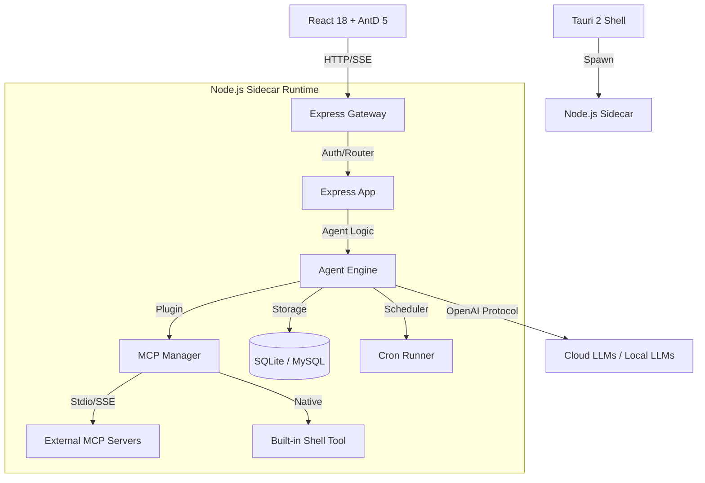

# workhorse

> **Workhorse** 是一个本地优先、隐私安全的个人 AI Assistant 工作台。

它不仅仅是一个聊天界面，更是一个集成了 **LLM 调度、MCP 工具扩展、自动化任务 (Agent Tasks) 和 定时任务 (Cron Jobs)** 的全能效率中心。


---

## 核心目标

1.  **本地优先 (Local-First)**：数据存储在本地 SQLite，配置与敏感信息不出本地环境。
2.  **模块化扩展 (Modular)**：通过 MCP (Model Context Protocol) 协议接入任何外部工具。
3.  **自动化流水线 (Automation)**：支持 Agent 级任务编排与定时调度，解放生产力。
4.  **开发者友好 (Developer First)**：基于 Node.js 全栈，易于二次开发与私有化部署。

## 关键特性

-   **全能对话**：流式输出、Markdown 渲染、代码高亮、数学公式 (LaTeX)、图片预览与重采样。
-   **端点聚合**：支持 OpenAI Compatible、OpenAI、Gemini、OpenRouter 等多种主流模型网关。
-   **Agent 引擎**：ReAct 循环驱动，支持多步推理、工具决策、长上下文压缩与 Token 预算管理。
-   **MCP 生态**：支持 Stdio 与 SSE 两种 transport，内置 `shell_execute` 安全执行沙箱。
-   **自动化任务**：
    -   **Agent Tasks**：预设场景化 Prompt 与工具组合，一键运行。
    -   **Cron Jobs**：强大的定时调度系统，支持任务运行历史回溯。
-   **频道集成**：内置钉钉 (DingTalk) 等 Webhook 支持，可通过命令触发本地任务。
-   **API 代理**：内置 `/v1/*` 兼容接口，可作为其他 AI 工具（如 Cursor/Cline）的网关。

## 技术架构

Workhorse 采用现代桌面应用架构，结合了 Web 技术的灵活性与本地系统的强大能力：



## 目录结构

```text
.
├── server.js                  # Node sidecar 全量入口
├── server/                    # 后端逻辑内核
│   ├── models/                # 核心引擎 (Agent, MCP, Database)
│   ├── routes/                # API 接口路由 (Chat, Skills, Tasks, Cron)
│   └── utils/                 # 工具类 (Context Budget, Tokenizer, Prompt Builder)
├── src/                       # 前端 React 源码
├── src-tauri/                 # Tauri 壳配置与跨平台构建
├── docs/                      # 深度设计文档与规格说明
├── data/                      # 默认数据存储位置 (~/.workhorse)
└── tests/                     # 自动化测试用例 (Vitest)
```

## 快速开始

### 运行环境
-   Node.js >= 20
-   npm >= 10
-   Rust (仅在需要打包或修改桌面壳逻辑时)

### 1. 安装依赖
```bash
npm install
```

### 2. 启动开发模式
默认会同时启动前端 Vite 服务、API 网关服务以及 Tauri 桌面壳（推荐）：
```bash
npm run dev:tauri
```

如果您只需在浏览器中调试 Web 端：
```bash
npm run dev
```
-   前端入口: `http://127.0.0.1:12620`
-   网关入口: `http://127.0.0.1:12621`

### 3. 构建与打包
```bash
# 构建前端产物
npm run build:frontend

# 构建桌面可执行程序 (macOS 下产出 .app)
npm run build:tauri
```

## 配置说明

Workhorse 自带完整的可视化配置界面，但也支持通过环境变量进行高级微调：

| 变量 | 默认值 | 说明 |
| :--- | :--- | :--- |
| `PORT` | `12621` | 本地后端 API 端口 |
| `DB_CLIENT` | `sqlite` | 建议使用 `sqlite`，也支持 `mysql` |
| `DB_PATH` | `~/.workhorse/chat.db` | 数据库存放位置 |
| `WORKHORSE_WORKSPACE_ROOT` | (Current Dir) | Shell 工具默认的工作根目录 |

## 开发者文档

更多深入信息请参考 `docs/` 目录：

-   [项目设计全景](docs/project.md)
-   [技术架构深探](docs/architecture.md)
-   [Agent 任务规格说明](docs/agent_task_spec.md)
-   [产品演进历程](docs/evolution.md)

## 开源协议

MIT License.
_SYSTEM_PROMPT_MD` | 空     | 全局系统提示词默认值  |

### 数据库

| 变量          | 默认值         | 说明                    |
| ------------- | -------------- | ----------------------- |
| `DB_CLIENT`   | `sqlite`       | 支持 `sqlite` / `mysql` |
| `DB_PATH`     | `~/.workhorse/chat.db` | SQLite 文件路径         |
| `DB_HOST`     | `127.0.0.1`    | MySQL 主机              |
| `DB_PORT`     | `3306`         | MySQL 端口              |
| `DB_USER`     | `root`         | MySQL 用户              |
| `DB_PASSWORD` | 空             | MySQL 密码              |
| `DB_NAME`     | `gemini_chat`  | MySQL 库名              |

### 前端

| 变量                | 默认值 | 说明                                 |
| ------------------- | ------ | ------------------------------------ |
| `VITE_API_BASE_URL` | 空     | 仅在需要覆盖桌面端默认后端地址时使用 |

## 当前约束

- 当前实现默认是单机桌面模式，鉴权上下文会注入本地用户 `local`
- `src-tauri/sidecar/` 需要存在可执行 sidecar，Tauri 打包时会一并带入
- 生产桌面版前端请求默认走 `http://127.0.0.1:12621`
